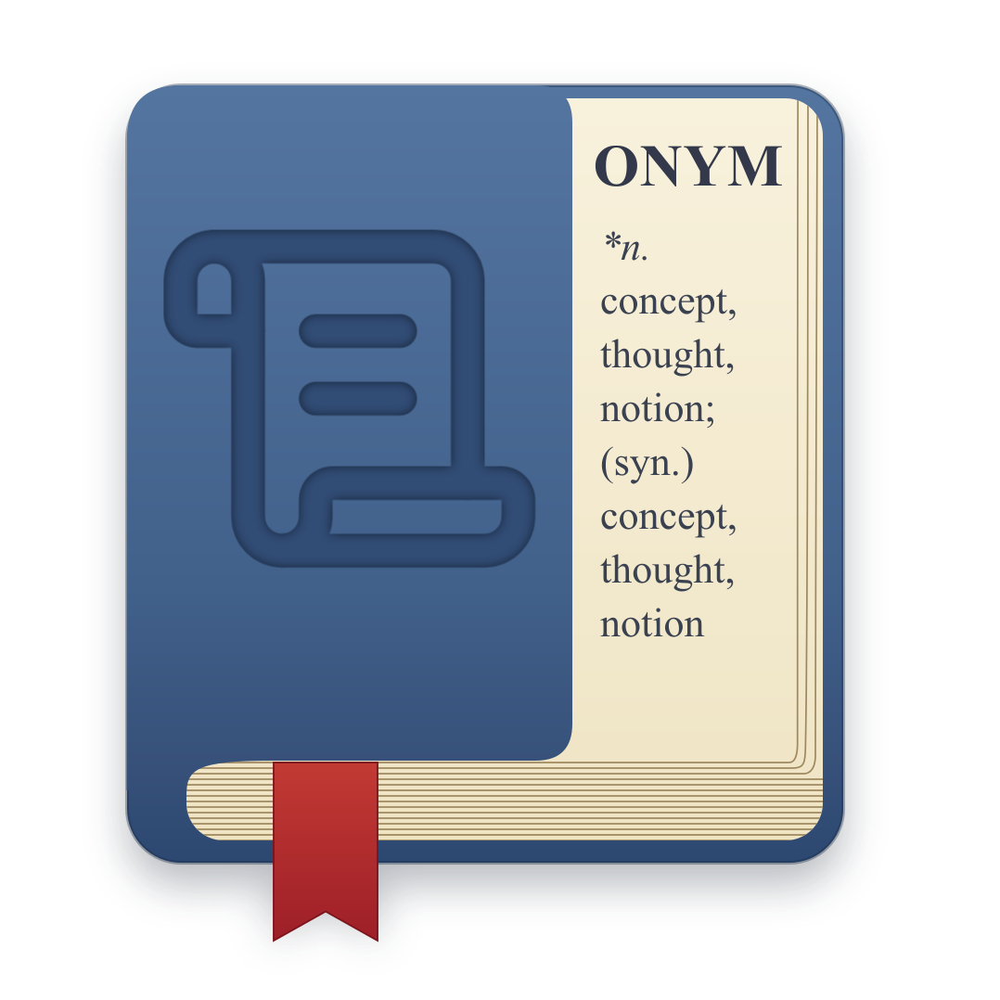

<!--
SPDX-FileCopyrightText: 2026 ursa.nz <code@ursa.nz>
SPDX-License-Identifier: GPL-3.0-or-later
-->

<p align="center">
  
</p>

<h1 align="center">Onym</h1>

Onym is a thesaurus and dictionary for GNOME, built on WordNet. You type a word and Onym shows its
meanings grouped by part of speech, with example sentences, then its synonyms, its antonyms, and the
lexical relations that connect it to other words. Those related terms are clickable, so one lookup
leads to the next with a click. Search is live, with completion as you type and a suggestion when a
word is misspelt.

The word data comes from WordNet, the lexical database from Princeton University. The lookup engine
is [onym-engine](https://forge.ursa.nz/ursa-nz/onym-engine), a shared Rust core whose behaviour
derives from Artha, an earlier WordNet thesaurus by Sundaram Ramaswamy. Onym is a fresh GTK4 and
libadwaita application around that engine, built to feel at home on GNOME 50 and later.

## Status

Onym is functional: the GTK4 and libadwaita application, the `libonym` library, and a headless
command line tool. The application shows meanings grouped by part of speech with examples, then
synonyms, antonyms, and the lexical relation trees, with live search, history, and an accessibility
pass. It ships an icon, a desktop entry, AppStream metainfo, and a Flatpak that bundles WordNet.

- `libonym` is an installable library that turns a word into a structured result. It is the reusable
  core, with a stable model, a pkg-config file, and GObject Introspection so it binds from C, Python,
  JavaScript, and Vala.
- `onym-cli` is a small tool that looks words up from the terminal. It proves the library and drives
  the tests.

## Building

Onym uses Meson. The library needs GLib, a Rust toolchain for the engine, the WordNet database,
and an onym-engine checkout beside this repository (or name one with `-Donym_engine_dir`). On
Debian or Ubuntu:

```
sudo apt install meson cargo rustc wordnet-base libglib2.0-dev gobject-introspection libgirepository1.0-dev
git clone https://forge.ursa.nz/ursa-nz/onym-engine.git ../onym-engine
meson setup _build
meson compile -C _build
meson test -C _build
```

Try it:

```
./_build/tools/onym-cli serendipity
./_build/tools/onym-cli --complete sere
```

## Flatpak

A Flatpak manifest is at `build-aux/nz.ursa.Onym.yaml`, building against `org.gnome.Platform`. It
bundles WordNet, so the Flatpak needs nothing else installed:

```
flatpak-builder --user --install --force-clean _flatpak build-aux/nz.ursa.Onym.yaml
flatpak run nz.ursa.Onym
```

## How the code is organised

Onym is three layers, so the lexical machinery stays sealed off and the rest stays easy to follow.

- The **engine** is the shared onym-engine Rust core, linked in as a static archive through its C
  ABI. It owns the WordNet file parsing, the morphology, the lookup rules, and the lemma index,
  and it is conformance-tested in its own repository.
- The **bridge** is the only code that calls the engine. It copies what the engine returns into a
  clean model of plain objects, then frees the engine's data.
- The **library and application** see only that model. They never know WordNet exists.

`OnymEngine` is the object you ask for a lookup. It hands back an `OnymResult`, which is a list of
sections, each holding definitions, words, or antonyms. The application renders that result and never
parses anything itself. `ARCHITECTURE.md` describes the layers and the files in more detail.

## Licence and credits

Onym is free software under the GPL, version 3 or later. See `COPYING`.

- WordNet is provided by Princeton University under its own permissive licence. Its notice ships with
  the bundled database, which comes from Debian's wordnet-base package with Debian's fixes.
- The lookup engine is onym-engine, GPL-3.0-or-later, whose behaviour derives from Artha by
  Sundaram Ramaswamy; the derivation is recorded in that repository's PROVENANCE.md.
- Onym is built with GTK, libadwaita, and GLib from the GNOME project.
